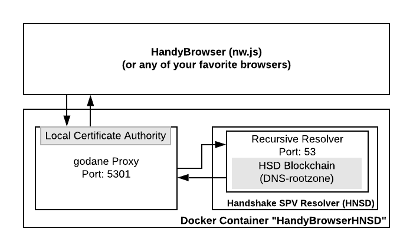

## HandyBrowser


### Download Latest Prebuilt HandyBrowser in [Releases](https://github.com/HandyMiner/HandyBrowser/releases) [Skips all the steps below]

### Building from Source

First, install frontend client dependencies

0. ```npm install -g bower```
1. ```bower install```

#### Building for Mac

0. [Download nw.js](https://nwjs.io/)
1. Copy this repo to folder ```./nwjs.app/Contents/Resources/app.nw```
2. Copy app.icns, document.icns to ```./nwjs.app/Contents/Resources/```
3. To change the app display names, follow directions [here](https://nwjs.readthedocs.io/en/latest/For%20Users/Package%20and%20Distribute/)

#### Building for Windows / Linux

0. [Download nw.js](https://nwjs.io/)
1. Checkout this repo into the nw.js directory next to nwjs.exe as a folder named ```package.nw```
2. To change icons, use ResourceHacker to modify nwjs.exe icons
3. Further options to build/distribute [here](https://nwjs.readthedocs.io/en/latest/For%20Users/Package%20and%20Distribute/)

### How HandyBrowser Works

HandyBrowser is using node-webkit [nw.js](https://nwjs.io) under the hood. Nw.js packages the latest chromium with the latest node.js and allows us granular security, html and many other features. 
Since we did not want users to manually have to modify system level configurations and run HNSD/HNS resolvers locally themselves, we rely on Docker. 
Docker allows us to create a lightweight linux virtual machine that installs HNS resolvers, and is pre-configured to use the HNS resolver. We simply proxy all web traffic from the chromium browser into the Docker machine which resolves via HSD and returns content! Docker generates a self-signed certificate on container creation which allows the user to proxy https traffic to the browser. **During installation Docker runs a one-time install process, after that it won't need to be run again, and you'll be able to start browsing/resolving names immediately (even as the HSD fullnodes syncs in Docker).**



Why Nw.js over Electron? The lead-dev of this project has used Nw.js extensively in enterprise-class application for many years and knows the inside/outs of every piece of the framework. In addition, the window manager (urlbar) we wrote needed to control all windows (tabs) created within the application and IPC is not fun. Nw.js allowed us more flexibility for the task of building a web-browser while offering the security we needed: No browser windows have access to Node.js, just the window manager. 
[More reasons here, including: ](https://hackernoon.com/why-i-prefer-nw-js-over-electron-2018-comparison-e60b7289752) ```"Even better, you can run Chrome Apps/extensions using NW.js"```


### HandyBrowser v0.1.0 Features

  - Imports Bookmarks locally from Google Chrome
  - Bookmark Manager and Bookmarks Bar
  - Network map for Handshake nodes; allows browser users to see the network grow globally as new browser users come online.
  - Custom "HNS Lock" that changes color between White [HNS]/Dark Grey[DNS]/Green [DNSSEC+HNS] to notate how you're connecting over DNS.
  - Video playback support, enjoy YouTube and Netflix.
  - Donate modal for the HandyBrowser team.
  - Use the HandyBrowser Docker container as a proxy for your mainstream browser to resolve Handshake Names. After starting HandyBrowser, set your mainstream browser proxy to ```localhost:5301```
  
### HandyBrowser TODOs

1. Re-enable HNSD when it's production ready. We got HNSD to work and the dockerfile is there to build. Setting ```this.resolver = 'hsd'; //|| hnsd``` to 'hnsd' in file ```js/boot.js:24``` will allow you to boot with hnsd. Why not HNSD? We had issues with queueing and timeouts at scale. It works great for one site at a time. However when opening multiple tabs with tons of analytics happening (google.com, ebay.com, facebook.com, yahoo.com) HNSD would have a request that would lag and cause subsequent requests to wait for a timeout to happen. Replicating can be done by modifying ```/etc/resolv.conf``` to use ```8.8.8.8``` instead of ```127.0.0.1``` and see the difference. Thus we use hsd for now [PRs welcome if you can get it working].

2. It would be great to not need Docker's overhead. If there were a way to tell the browser which DNS to use locally that would be ideal. We're going work with the community and see if there's a more elegant solution in time. If a VM is neccessary, hyperkit or HyperV could be ideal alternatives to Docker.

3. Re-enable the HandyMiner GUI that's built in already. Shell script/workflow to install hstratum onto the dockerized HSD machine needs to be made.

4. Figure out how to get Chrome extensions working. They are most certainly supported in nw.js.

5. Add native-styled close menu buttons for most linux variants. Right now its styled like Ubuntu 16.

### HandyBrowser Install FAQS

  - Before running HandyBrowser the first time, make sure you have Docker installed and running [Note you don't need a Docker account, simply just the Docker service so we can install the dependencies for your Handshake node]:

MacOS - https://docs.docker.com/docker-for-mac/release-notes/

Windows - https://docs.docker.com/docker-for-windows/release-notes/

Linux - https://docs.docker.com/engine/install/

  - The initial setup prompt for HSD should take 3-4minutes [this will change with the HNSD light client], and only needs to be done once. When you restart the app in the future it won’t need to occur, and the app will automatically start syncing your browser up-to-date.
  - Your firewall may prompt you a couple of times for permissions the first time you run the browser, be sure to accept those. We need them to make the browser work.
  - If you have any trouble with your Docker node not loading, either use the 'nuke' option in the HandyBrowser Menu or enter these commands in your terminal, and run the browser once more:
  ```sh
$ docker stop HandyBrowserHSD
$ docker rm HandyBrowserHSD
$ docker image rm handybrowser
```

  - To SSH into your docker container: ```docker exec -it HandyBrowserHSD bash```

### Project Roadmap [Donation Driven Development]

0. Build-in WebRTC Video/Audio chat + Screensharing utilizing Handshake

### HandyBrowser Support Telegram/Handshake Discussion:
[🤝 HandshakeTalk Telegram](http://t.me/HandshakeTalk)

### Donate HNS to the HandyBrowser Team:


HNS: ```hs1qwfpd5ukdwdew7tn7vdgtk0luglgckp3klj44f8```


##### [LICENSE](https://github.com/HandyMiner/HandyBrowser/blob/master/LICENSE) 

HandyBrowser - a Chromium Browser powered by Handshake Resolver.
    
Copyright (C) 2020  
Alex Smith - alex.smith@earthlab.tech
Steven McKie - mckie@amentum.org
Thomas Costanzo - stanzo89@gmail.com

This library is free software; you can redistribute it and/or
modify it under the terms of the GNU Lesser General Public
License as published by the Free Software Foundation; either
version 2.1 of the License, or (at your option) any later version.
This library is distributed in the hope that it will be useful,
but WITHOUT ANY WARRANTY; without even the implied warranty of
MERCHANTABILITY or FITNESS FOR A PARTICULAR PURPOSE.  See the GNU
Lesser General Public License for more details.
You should have received a copy of the GNU Lesser General Public
License along with this library; if not, write to the Free Software
Foundation, Inc., 51 Franklin Street, Fifth Floor, Boston, MA 02110-1301 USA


